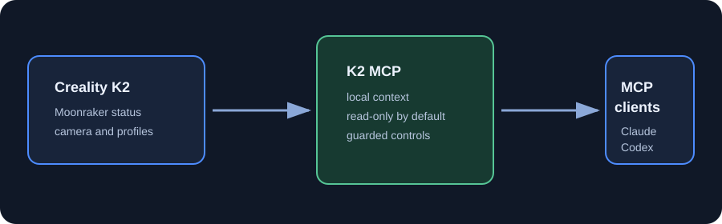

# Creality K2 MCP

Give MCP clients useful, local context about a Creality K2. The server reads
live Moonraker state, camera snapshots, local slicer profiles, G-code metadata,
and Creality 3MF project settings so a client can help with the work around a
print instead of guessing.



The verified target is a Creality K2 with Moonraker on the local network. Other
printers are not claimed as compatible. The adapter guide explains how to test
and add another Moonraker-based machine honestly.

## What it gives an MCP client

- Current print state, progress, elapsed and estimated remaining time.
- K2 layer data from `virtual_sdcard`, plus model and side fan values from the
  K2-specific `fan0` and `fan2` output pins.
- Nozzle and bed temperatures, a camera snapshot, print history, and recent
  Klipper messages.
- Read-only inspection of a local G-code file or Creality 3MF project.
- The actual profiles installed on the computer, not an invented list.
- Optional, bounded printer actions only after the owner explicitly enables
  them. There is no raw G-code execution tool.

## Start here if you are not a developer

You only need your printer model and its local network address. Install the
project from the repository, then paste this into Claude, Codex, or another MCP
client that can help with local setup:

```text
I want to connect my 3D printer to this Creality K2 MCP project.

Printer model: Creality K2
Printer local address: YOUR_PRINTER_HOST
Printer port: 7125
Operating system: Windows
MCP client: Claude Desktop or Codex

Guide me one step at a time. Keep printer control read-only at first. Explain
what every setting does, create the right local client configuration, ask me to
restart the client, and test only printer status. Do not enable any command
that changes the printer unless I explicitly ask for it after the read-only
test works.
```

Use `YOUR_PRINTER_HOST` as a placeholder only. Replace it with the address you
see for your own printer on your own network.

## Manual installation

Requirements: Python 3.10 or newer, the project files, and local network access
to the K2. Creality Print is optional unless you want profile-guided slice
planning.

```powershell
git clone https://github.com/sabnck/creality-k2-mcp.git
cd creality-k2-mcp
python -m venv .venv
.\.venv\Scripts\python.exe -m pip install -e .
```

Then choose the configuration example for your MCP client:

- [Claude Desktop example](examples/claude_desktop_config.json)
- [Codex example](examples/codex_config.toml)

Set `K2_HOST` to the local address of the printer. Leave `K2_ALLOW_WRITE` at
`0` for the first connection. Restart the MCP client and ask: “What is the
current printer status?”

## Read-only first

The normal setup is read-only. It can answer questions such as:

- “How far through is the current print, and what is the estimated time left?”
- “Show a current camera snapshot and flag anything unusual.”
- “Read this 3MF and explain its layer height, walls, infill, supports, and
  printer profile.”
- “Compare these two G-code files by estimated time, filament weight, and
  layer count.”
- “Which K2 profiles are actually installed for a 0.4 nozzle?”

## Optional printer control

Set `K2_ALLOW_WRITE=1` only when you want the client to be able to change a
real printer. Even then, every action is limited to a named operation with
fixed bounds:

| Operation | Guardrail |
| --- | --- |
| Pause or resume | Requires write access to be enabled. |
| Cancel | Requires `confirm='CONFIRM'`. |
| Upload G-code | Only `.gcode`; starting immediately also requires confirmation. |
| Nozzle temperature | 0 to `K2_MAX_NOZZLE`, default ceiling 280 C. |
| Bed temperature | 0 to `K2_MAX_BED`, default ceiling 110 C. |
| Print speed | 30 to 150 percent. |
| Model fan | 0 to 100 percent. |

There is deliberately no general “run this G-code” tool.

## Compatibility

| Target | Status | Notes |
| --- | --- | --- |
| Creality K2 with local Moonraker | Verified | This project's runtime target. |
| Another Creality printer | Not verified | Follow the adapter guide and test its actual objects. |
| Generic Moonraker or Klipper printer | Not verified | Similar transport, different object names and safety limits may apply. |

## Troubleshooting

| Symptom | What to check |
| --- | --- |
| Status cannot connect | Confirm the printer is powered on, reachable locally, and `K2_HOST` and `K2_PORT` are correct. |
| Layers show as unknown | Confirm the printer exposes `virtual_sdcard`; this is the K2 source used by the adapter. |
| Camera is unavailable | Check `K2_CAM_PORT`, then try the K2 camera in a browser on the same network. |
| Profiles are empty | Point `K2_PROFILES` at Creality Print's `resources/profiles/Creality` directory. |
| Slice planning says Creality Print is missing | Set `K2_CLI` to the local CrealityPrint executable. |

Read [Safety](docs/SAFETY.md) before enabling printer control. For a different
machine, read the [adapter guide](docs/ADAPTER_GUIDE.md).

Portuguese: [README.pt-BR.md](README.pt-BR.md)

## Contributing and license

Please report compatibility results with the printer model, firmware context,
sanitized object response, and what was actually tested. Do not include local
addresses, screenshots, G-code, models, or credentials.

Created and maintained by Fernandes. Released under the [MIT License](LICENSE).
